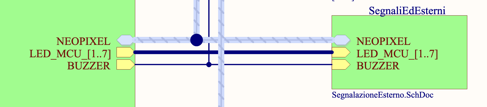
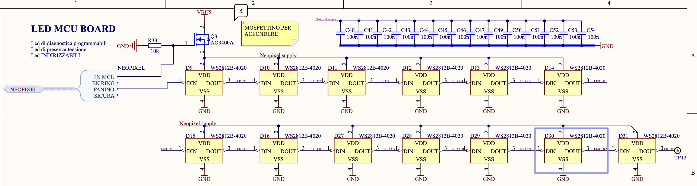
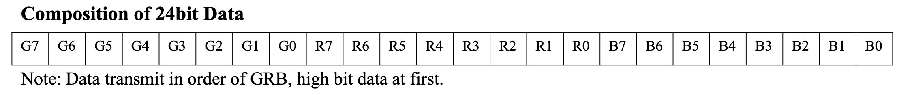
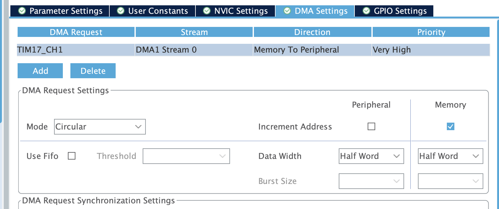
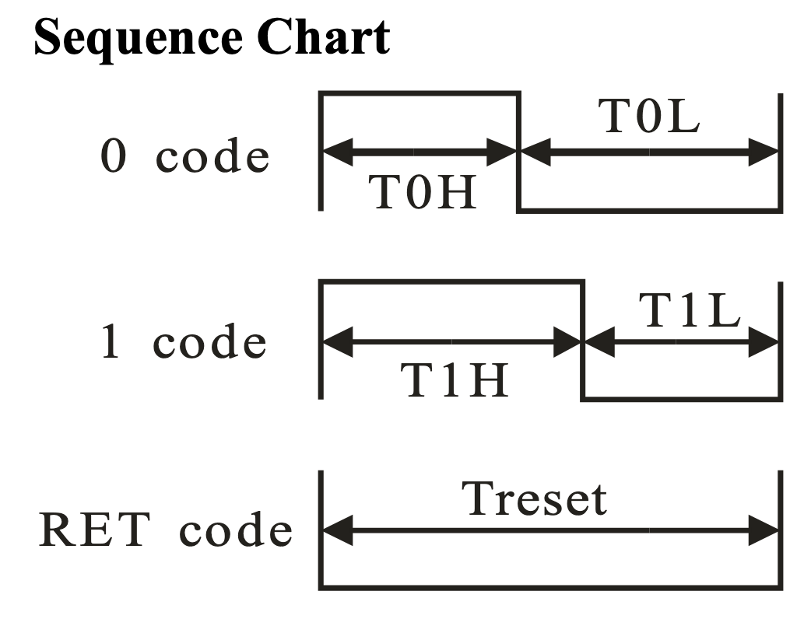

# Addressable led(s)

## Documentazione da PDF:




Abbiamo a disposizione 13 LED disposti lungo l'esterno del pcb di [asterics-MCU](../asterics/mcu.md). Sono controllati attravero il pin **PB9** del microcontrollore. Hanno a disposizione il timer 17 e il timer 4 per il pilotaggio.
Abbiamo inoltre a disposizione una striscia LED lungo il diametro della fusoliera. Questi sono controllati attraverso il **PB8**.

Per risparmiare energia quando i led sono spenti, sulla MCU è presente un mosfet per abilitare la rail di alimentazione **PF6**, mentre nel [RING](../asterics/ring.md) l'alimentazione viene abilitata da un regolatore su [PWR](../asterics/pwr.md) attraverso il pin **PF5**.

## Come controllare i neopixel?

Questa tipologia di led indirizzabile sfrutta un protocollo "proprietario" che codifica gli stati logici di ```1``` e ```0``` modulando l'ampiezza di un'onda quadra, cioè con un PWM.
Per questo motivo possiamo utilizzare la funzione dei timer dell'stm per generare gli impulsi di periodo e ampiezza appropiati.
I led comunicano ad una velocità fissata di $800\text{kHz}$, questo vuol dire che ogni *bit* viene trasmesso ogni $1.25\mu s$.

### Fisicamente cosa accade?

I neopixel che abbiamo montato sono pensati per lavorare a 5V, ma possono tranquillamente lavorare con un'alimentazione a 3.3V, nel nostro caso gli forniamo 5V direttamente dal rail principale. Logicamente li facciamo lavorare con un segnale a 3.3V.
Come si nota dalla figura presa dallo schema elettrico, i singoli *PIXEL*, ovvero i led fisicamente montati sul PCB, sono collegati a cascata: l'uscita del primo è connessa con l'ingresso del secondo e così via.
Internamente ciascun *pixel*, è composto da 3 led: uno per ogni componente Rosso, Verde, Blu. 

Ciascun LED (ovvero uno dei 3 di ogni pixel) ha una risoluzione di 8bit. Questo vuol dire che per indicare il colore di un *pixel* avremo bisogno di 24bit che dovranno essere inviati uno di seguito all'altro con l'ordine dato dalla documentazione dei led:
. Per impostare il colore sul secondo *pixel* della serie si continua a trasmettere. Nella logica interna del pixel vengono utilizzati i primi 24bit che riceve (e non li ritrasmette in uscita) mentre dal 25-esimo in poi vengono riamplificati e mandati al pixel successivo.

Avendo a disposizione 13 pixel, ognuno dei quali ha bisogno di 3 byte per indicare il colore, per immagazzinare l'informazione di ciascun pixel avremo bisogno di $13\times 3=39\text {byte}$ + 50byte in coda tutti da 0 per indicare che intendiamo resettare la comunicazione e ripartire dal pixel 0.
Per semplicità supponiamo di dover allocare un buffer da 100byte.

### Come utilizzare il timer (e il DMA) per inviare

!!! info
(tralasciamo inizialmente i discorsi operativi su come impostare la temporizzazione)


Abbiamo detto che i pixel comunicano con il duty cycle di un segnale pwm. Sappiamo che il periodo di questo segnale deve essere $1.25\mu s$. Abilitiamo il timer corretto per i pin che vogliamo usare, abilitiamo la funzione "pwm generation chx". Nel menù dei parametri impostiamo l'ARR (Auto Reload Register) in modo che la frequenza di lavoro sia $800 kHz$, mi segno anche questo valore perchè sarà utile tra poco.

Adesso vado nella sezione DMA e abilito una richiesta per l'aggiornamento del DMA al canale appena abilitato. La direzione deve essere da memoria a periferica e la priorità è da vedere. 
Un'altro parametro da considerare è il "mode" ovvero se considerare il buffer dei pixel come circolare o normale. La differenza dovrebbe essere che nel caso del buffer circolare il dma non si ferma automaticamente (ma non prendete queste parole per vero, se lo testate correggetemi grazie). Impostare anche l'incremento di indirizzo nella memoria. La larghezza delle parole non è importante.

!!! tip "Riassuntino"
- Chiamiamo tutti i dispositivi connessi **pixel**, ciascun pixel è composto da 3 led.
- Per indicare il colore da mostrare su ciascun pixel abbiamo bisogno di 24 bit: 3 parole da 1 byte ordinate GRB con primo bit MSB
- Per inviare ciascun bit utilizziamo un segnale PWM con dyty cycle specifico.
- Dobbiamo inviare di seguito ciascun bit, se non inviamo alcun dato e lasciamo il "filo" basso per $t>280\mu s$ la comunicazione si resetta e possiamo reimpostare il primo pixel.
- I pixel lavorano come degli shift register, ma al contrario: i primi 24 bit vanno al primo pixel, dal 25esimo al 49esimo al secondo e così via.
- Per generare il segnale PWM a duty cycle utilizziamo una periferica timer del microcontrollore in combinazione al DMA per alleggerire il carico sulla logica di controllo


Per semplificare la comunicazione con i led, possiamo utilizzare il DMA: configuriamo la periferica timer in modo che utilizzi un canale del dma in modo che ogni volta che ha finito di trasmettere il singolo bit, il dma aggiorni il valore del registro *pulse* con il valore successivo. \
Per fare questo abbiamo bisogno di 2 cose:
1. un buffer abbastanza capiente per le informazioni dei led
   !!! note
   è possibile anche usare un mezzo buffer e usare il callback corrispondente per risparmiare memoria

2. implementare da qualche parte il Callback del TIM PWM PulseFinishedCallback
3. Implementare un metodo che faccia partire lo stream del DMA per il timer e il canale corretto

A questo punto possiamo implementare le funzioni che aggiornano/impostano i colori dei led a seconda dell'operazione da effettuare.

## Come configurare il timer

Per la teoria generale su come funzioni / cosa sia / cosa faccia il timer guarda la sua [pagina di documentazione qua](../../hw/peripheral/timer.md).

Dando per scontato il funzionamento di base, dobbiamo impostare il periodo di ripetizione del timer tale da generare un segnale a $800\text{kHz}$, che da adesso chiameremo $f_{PWM}$ quindi avremo bisogno di sapere la frequenza di lavoro del timer in questione (aprendo il datasheet e navigando al block diagram del microcontrollore o aprendo [questo file qua](../stm32h723zg-block-diagram.pdf)).

Troviamo quindi a quale dominio il nostro timer appartiene, ad esempio **APB2**. Adesso andiamo nella "clock configuration" dell'ioc e cerchiamo a quale frequenza lavora il corrispondente dominio.

!!! warning
Questa sarà la frequenza in ingresso al timer $f_{tim}$


### Calcolo dell'ARR

Dobbiamo configurare il timer in modo da ottenere la $f_{PWM}$ corretta. Per farlo dobbiamo trovare il valore del registro $ARR$ che consente questa divisione. Per trovarlo faremo quindi:

\[
ARR = \frac{f_{tim}}{f_{PWM}} - 1
\]
Possiamo inserire solo numeri interi, quindi nel caso in cui non venga un rapporto intero si può approssimare.

### Calcolo DutyCycle bit

Non resta che calcolare quanto deve valere il duty cycle per indicare il valore 0 e 1. Per farlo dobbiamo capire l'intervallo di tempo che il segnale generato dal timer rimanga alto e quanto basso. 

!!! warning
    Questo parametro specialmente è dipendente dal tipo di neopixel usato, quindi è sempre meglio controllare sul datasheet


Nel caso dei WS2812B-4020, abbiamo da rispettare questa *chiarissima* temporizzazione che si traduce nel fatto che per indicare uno $ZERO$ dobbiamo tenere il segnale alto per $1/4$ del periodo, mentre per indicare un $UNO$ dobbiamo stare intorno ai $3/4$ del periodo. Sperimentalmente si può provare diversi valori e spesso vale anche che lo $ZERO$ si ha quando il segnale è alto per $1/3$ e l'$UNO$ quando è alto per $2/3$
{align=right, width=400}

In ogni caso, dobbiamo capire come indicare al timer come impostare queste frazioni del periodo, per farlo dobbiamo impostare il valore nel registro *pulse*, o meglio, *dovremmo farlo* in quanto di questa operazione se ne occuperà il DMA e un nostro metodo incaricato di convertire la parola da 8bit in 8 parole da 16bit per il buffer da mandare al DMA.

Quindi:
$$
ZERO = (ARR+1) \cdot 1/4 \\
UNO = (ARR+1) \cdot 3/4
$$

Anche in questo caso è probabile che non si ottengano dei valori interi, per fortuna i neopixel non sono così fiscali con le temporizzazioni e quindi è possibile arrotondare all'intero più vicino senza che i simboli vengano fraintesi.

## Implementazione Codice

TODO: spiegone

## WS2812b

Sulla scheda abbiamo a disposizione 12 led rgb disposti a cerchio sul diametro esterno. Se la scheda viene operata senza la rossa, allora i led a disposizione sono solo 2.
Pertanto le notifiche più vitali sono riportate sui primi 2 led.

A seconda del pattern di lampeggio e dei colori abbiamo messaggi diversi:

- Tutti i led sfumano dal rosso allo spento ogni secondo -> Procedura di cancellazione della flash in corso
- Rapido lampaggio on off rosso -> 
  TODO: tabella con spiegazione degli errori
    

## Teoria sui led indirizzabili
Prendono in ingresso un segnale pwm che rappresenta l'```1``` o lo ```0``` logico a seconda della lunghezza della durata della parte alta del segnale. Il periodo del segnale PWM deve essere di $1.25 \mu s$.

Per i led che usiamo noi abbiamo che lo ```0``` logico corrisponde ad un "on time" di $0,4\mu s$. Mentre l'```1``` vuole un "on time" di $0,8\mu s$.

## Come configurare il progetto per avere i led funzionanti:
Si può usare sia il timer 8 che il timer 3. In entrambi i casi il canale è l'**1**

### Impostare il timer
Supponendo di aver settato il clock ad una frequenza di $f_{clk}=100Mhz$.
Dobbiamo andare a impostare l'AutoReloadRegister (ARR) in modo da ottenere il periodo da noi desiderato, quindi diremo che $$ ARR - 1 = \frac{f_{clk}}{f_{led}} = \frac{100MHz}{(1,25 \mu s)^{-1}} = \frac{100MHz}{800kHz} = 125 -1$$ (nota che il -1 è dovuto al fatto che nell'ioc devi mettere 124)

A questo punto non resta che controllare che il registro "pulse" del canale corretto sia uguale a 0.

Ricorda di abilitare lo stream DMA in memory to peripheral

### Assegnare i valori corretti ai bit
Come detto prima lo 0 e l'1 logici corrispondono a dei duty cycle. Calcoliamoli:
lo ```0``` corrisponde ad un duty cycle di $1/3$, quindi $\frac{125}{3} \approx 42$. Mentre l'```1``` corrisponde a $84$. Questi valori vanno impostati per la funzione che converte il valore da uint8 a valori del pwm da mettere nell'array che viene dato in pasto al DMA 