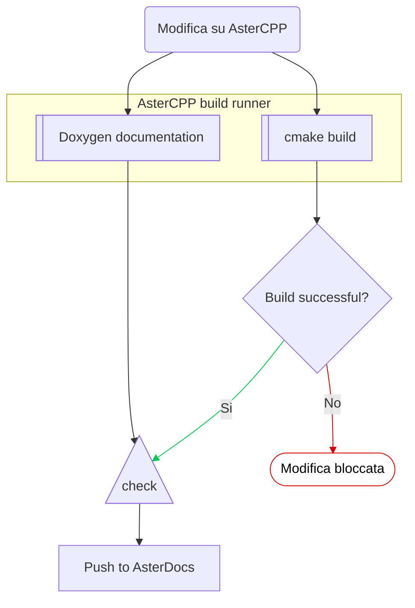
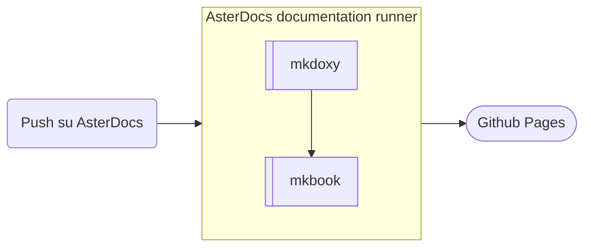

# Spiegazione della configuazione utilizzata nei runner
Il processo di build della documentazione funziona in due step: quando viene fatta una modifica su AsterCPP o una PR, parte in automatico il processo che controlla che le modifiche apportate facciano buildare correttamente.
Viene inoltre generata la documentazione con doxygen, viene trasformata con mkdoxy e pushata qua in AsterDocs per essere integrata con la documentazione generale.

Pushando la documentazione qua parte la fase 2, che compila la documentazione presente su AsterDocs e la pusha su gh pages automaticamente.

